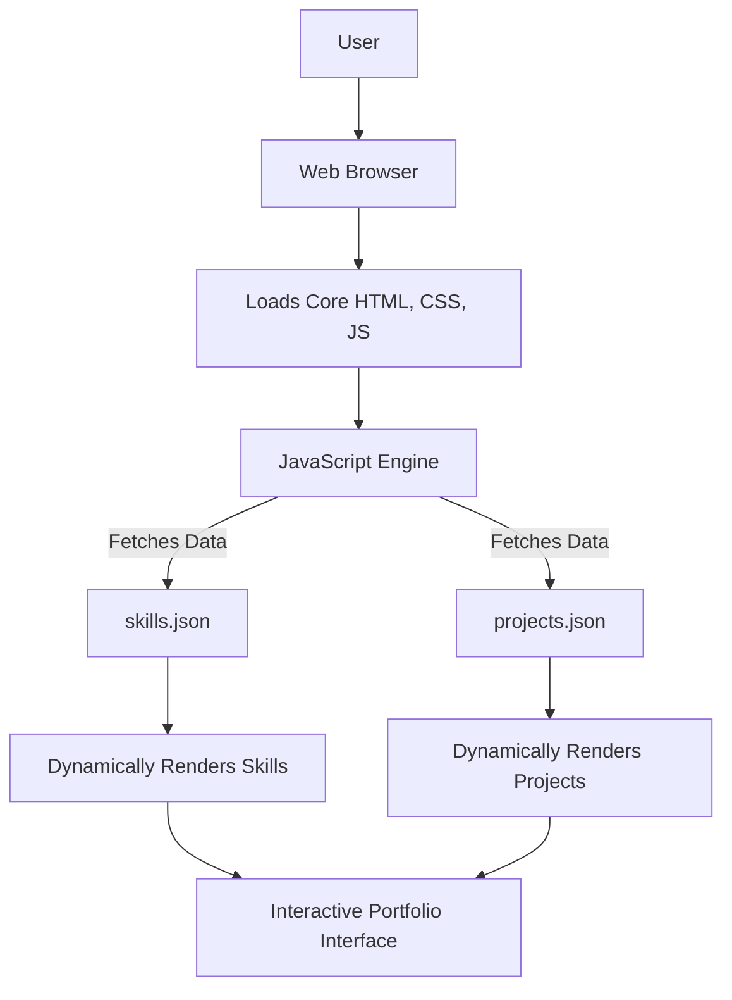

# 🚀 Personal Portfolio Website

<p align="center"></p>

## Short Description
Dive into a meticulously crafted personal portfolio website, engineered to dynamically showcase a developer's skills, projects, and professional journey. This repository presents a modern, responsive, and highly customizable platform designed for maximum impact, serving as a powerful digital resume that leaves a lasting impression.

## ✨ Key Features
*   **Dynamic Content Management:** Effortlessly update projects and skills via simple JSON files (`projects.json`, `skills.json`), ensuring your portfolio is always up-to-date without touching a single line of HTML.
*   **Automated CI/CD Pipeline:** Leveraging GitHub Actions, this project features a robust Continuous Integration and Continuous Deployment setup, ensuring every commit is automatically tested and deployed.
*   **Engaging User Experience:** Features interactive elements powered by `particles.min.js`, pre-loaders, and smooth transitions for a captivating browsing experience.
*   **Dedicated Sections:** Comprehensive `experience` and `projects` pages provide in-depth views of your accomplishments, complete with detailed descriptions and visual assets.
*   **Custom 404 Page:** A branded and user-friendly custom 404 error page ensures a polished experience even when navigating to non-existent links.
*   **Direct Resume Access:** A readily available `resume.pdf` ensures recruiters and potential employers can quickly review your qualifications.
*   **Fully Responsive Design:** Optimized for seamless viewing across all devices, from desktops to mobile phones, utilizing a clean and adaptive CSS architecture.

## Who is this for?
This project is ideal for:
*   **Developers & Job Seekers:** Present your work, skills, and experience in a professional, interactive, and visually appealing manner.
*   **Recruiters & Hiring Managers:** Quickly understand a candidate's technical capabilities and project history through a well-organized and dynamic platform.
*   **Collaborators & Clients:** Provide an easy-to-navigate overview of your expertise and past projects for potential partnerships.

## Technology Stack & Architecture
This portfolio is built with a focus on modern web standards and efficient delivery:

*   **Frontend:** HTML5, CSS3, JavaScript (Vanilla JS for core logic)
*   **Interactivity:** `particles.min.js` for dynamic visual effects.
*   **Content Structure:** JSON files for dynamic data rendering (skills, projects).
*   **Build & Deployment:** GitHub Actions for CI/CD automation.
*   **Version Control:** Git.
*   **Development Environment:** VS Code with custom settings for consistency.

## 📊 Architecture & Database Schema
The website's architecture is client-side driven, with data fetched dynamically from local JSON files. There's no backend database; content is managed directly within the repository.



## ⚡ Quick Start Guide

To get your hands on this exciting project:

1.  **Clone the Repository:**
    ```bash
    git clone https://github.com/kshitijshinde12/portfolio_website.git
    cd portfolio_website
    ```

2.  **Run Locally:**
    Open the `index.html` file directly in your web browser, or for a more robust local development experience, serve it using a simple HTTP server (e.g., Python's `http.server`):
    ```bash
    # From the project root directory
    python -m http.server 8000
    ```
    Then, open your browser to `http://localhost:8000`.

3.  **Customize Your Content:**
    *   Edit `projects/projects.json` to add or modify your project entries.
    *   Update `skills.json` to reflect your current skill set.
    *   Replace `assests/resume.pdf` with your own resume.
    *   Personalize images and textual content across the HTML files and CSS.

## 📜 License
This project is licensed under the terms specified in the `LICENSE` file within this repository.