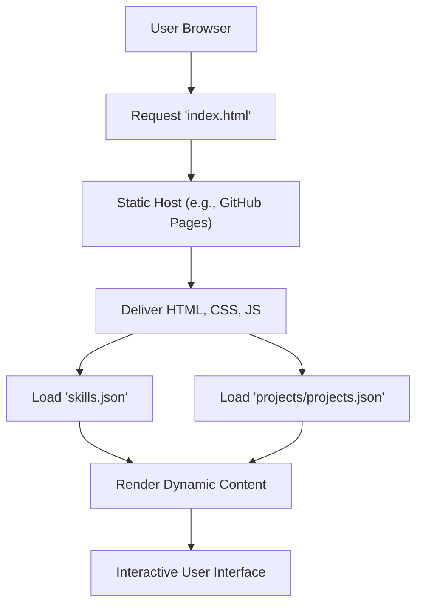

# 🚀 Dynamic Portfolio Website

<p align="center"></p>

## Short Description
This is a sophisticated, highly responsive personal portfolio website meticulously crafted to elegantly showcase a developer's skills, projects, and professional journey. Built with modern web technologies, it offers an engaging and intuitive user experience, making it an ideal platform for attracting prospective employers, collaborators, and anyone interested in your work.

## ✨ Key Features
*   **Stunning & Responsive Design:** Engineered with modern HTML5, CSS3, and JavaScript, ensuring a flawless and adaptive experience across all devices and screen sizes, from mobile to desktop.
*   **Comprehensive Project Showcase:** A dedicated and visually appealing section (`projects/`) to highlight a diverse range of technical projects, complete with dynamic content loading from JSON.
*   **Detailed Professional Experience:** A structured and engaging timeline of professional achievements, roles, and education (`experience/`) to provide clear insight into career progression.
*   **Dynamic Skills Overview:** Presents a clear, concise, and interactive snapshot of technical proficiencies and tools, powered by structured `skills.json` data.
*   **Interactive User Experience:** Enhanced with subtle animations and dynamic elements (e.g., `particles.min.js`, `hero.gif`) to captivate visitors and provide a memorable browsing experience.
*   **Automated CI/CD Pipeline:** Leverages GitHub Actions (`.github/workflows/ci-cd.yml`) for efficient, automated deployment, ensuring continuous integration and smooth, reliable updates.
*   **Custom 404 Error Page:** Provides a friendly, branded, and visually consistent experience even when users navigate to non-existent pages.
*   **Downloadable Resume:** Offers a convenient and direct link to a professional resume (`assests/resume.pdf`) for easy access by interested parties.

## Who is this for?
This portfolio website is meticulously designed for:
*   **Prospective Employers:** Easily review your capabilities, professional experience, and impactful project work in a structured and engaging format.
*   **Fellow Developers & Collaborators:** Explore your tech stack, understand your project methodologies, and identify potential areas for partnership or knowledge exchange.
*   **Anyone Interested in Your Work:** A professional and exciting platform to learn about your journey, contributions, and technical prowess.

## Technology Stack & Architecture
This portfolio is a prime example of a modern, highly performant static website. It leverages a robust set of frontend technologies and automation tools to deliver an exceptional user experience:
*   **Frontend:** Built upon the solid foundation of **HTML5**, **CSS3**, and **JavaScript**. Vanilla JavaScript is used for core logic, enhanced by lightweight libraries like **Particles.js** for captivating visual effects.
*   **Deployment & Automation:** Utilizes **GitHub Actions** for a robust Continuous Integration and Continuous Deployment (CI/CD) pipeline, streamlining updates and ensuring the website remains perpetually available and up-to-date.
*   **Content Management:** Project and skill data are efficiently managed via structured **`.json` files** (`projects/projects.json`, `skills.json`), demonstrating a clear separation of content from presentation logic.

## 📊 Architecture & Database Schema
This project employs a client-side architectural pattern typical of modern static websites. Content (such as projects and skills) is dynamically loaded from local JSON files by the client-side JavaScript. This approach delivers a fast, responsive, and interactive experience without the need for a traditional backend server or database.



## ⚡ Quick Start Guide
To get this impressive portfolio website up and running locally or to deploy your own personalized version, follow these straightforward steps:

1.  **Clone the repository:**
    ```bash
    git clone https://github.com/kshitijshinde12/portfolio_website.git
    cd portfolio_website
    ```
2.  **Open in your browser:**
    Simply open the `index.html` file in your preferred web browser. For most systems, you can just double-click the file, or use:
    ```bash
    # On macOS/Linux
    open index.html

    # Alternatively, manually navigate to: file:///<path_to_your_repo>/index.html
    ```
3.  **Customize (Optional but Recommended):**
    *   Update `projects/projects.json` and `skills.json` with your own unique data and achievements.
    *   Replace existing images in `assests/images/` and `assests/images/projects/` with your personal branding and project visuals.
    *   Substitute `assests/resume.pdf` with your professional resume.
    *   Personalize the HTML, CSS, and JavaScript files (`index.html`, `assests/css/style.css`, `assests/js/script.js`, etc.) to reflect your individual style and content.
4.  **Deploy (Optional):**
    Leverage the existing `.github/workflows/ci-cd.yml` configuration with GitHub Pages or your preferred static site hosting provider for automated, seamless deployment of your personalized portfolio.

## 📜 License
This project is licensed under the terms specified in the [LICENSE](LICENSE) file, which outlines the conditions under which this software can be used, modified, and distributed.